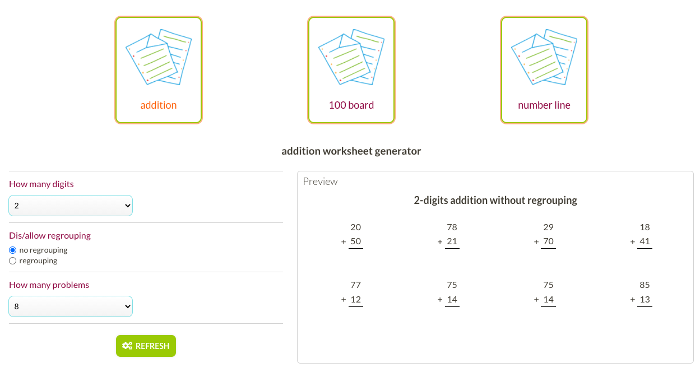
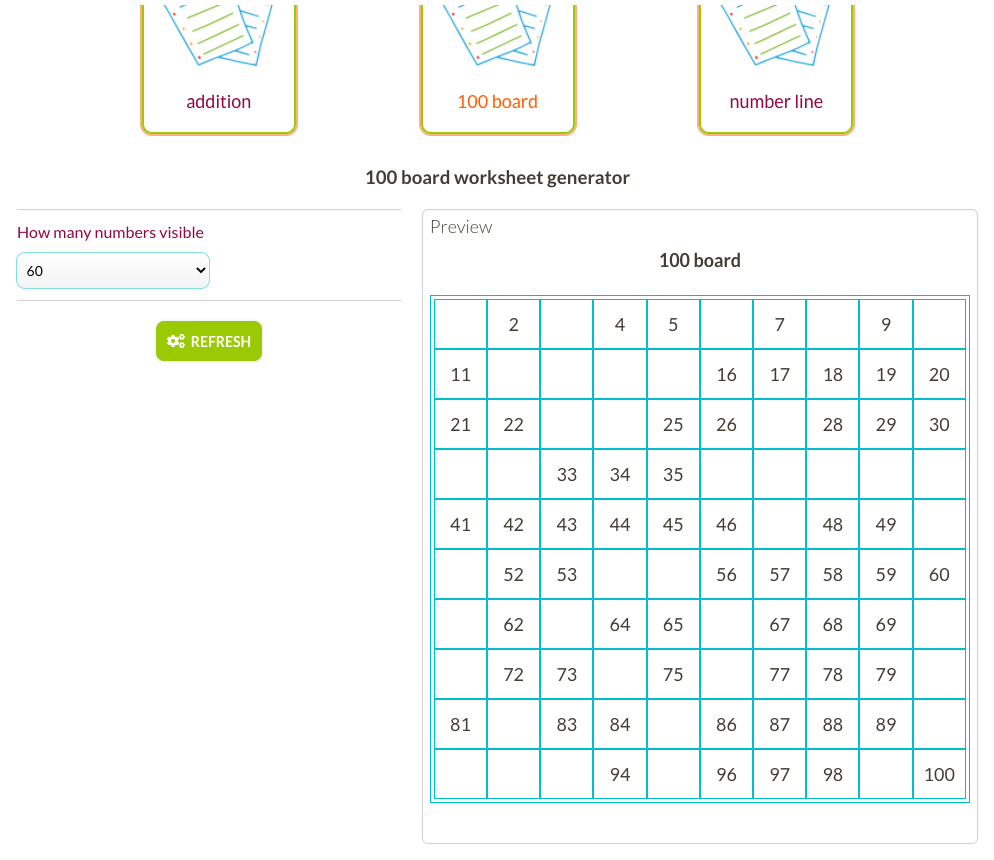
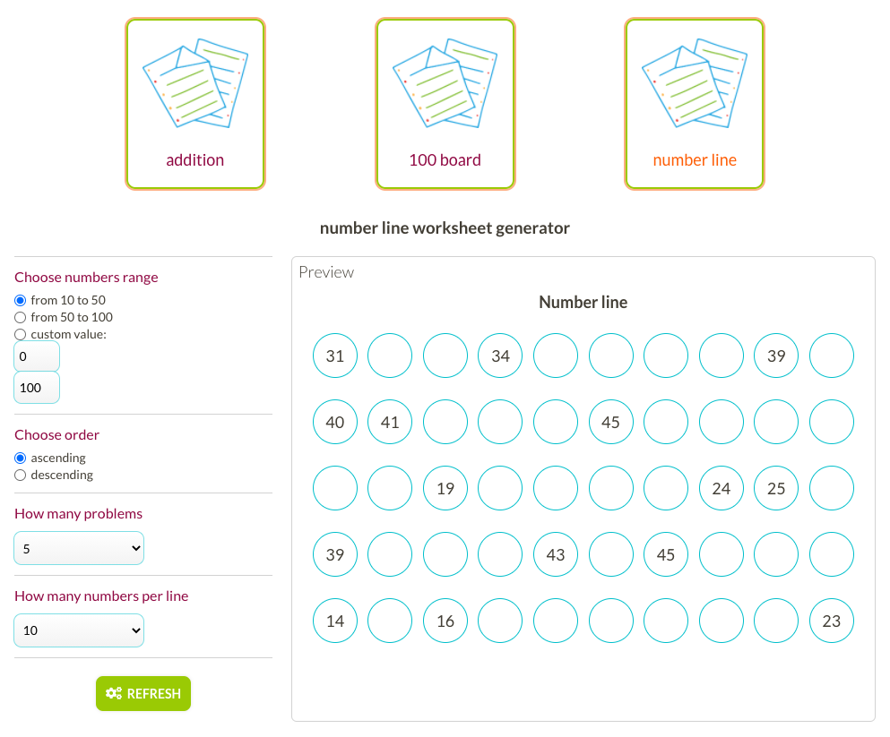

# Suen Learning

A web app for teachers and educators to create personalised materials for their students that can be shared online or exported to pdf.

### Why is this project needed?

Teachers & educators around the world spend a lot of time on preparing their own teaching materials. A lot of this work is repetitive and could be automated. Preparing high quality materials often requires not only a field knowledge, but also proficiency in using design tools. At the same time, there is a huge community of teachars who share their work with others, but way too often the materials cannot be personalised. Forcing thousands of educators to reinvent the wheel and create repetitive materials over and over.

By providing a tool we hope to help teachers to save time. Time, that in turn they will be able to spend on our children.

As a teacher, have you ever encountered materials that you liked, but...

- ...you'd need it with a different image, font or size? You loved the content, but design didn't feel right?
- ... it was written in a different language?
- ... you loved the file & the design but the text had to much/little details? Or you'd choose a bit different approach?

If yes, than our app is for you!

### How does it work?

1. Choose an activity from a list of given types
2. Adjust options according to your needs
3. Share with your students via a link or exporting the activity to .pdf
4. Receive personalised feedback on students' performance
5. Create your library of activities
6. Browse collections of other teachers and adapt their work to your needs

### Benefits

1. Save time - concentrate on what and we'll take care of the how
2. Save money - the app is and will always be free to use
3. Ad-free enviroment for students and teachers
4. No distractions - no unnecesary content which distracts the students, only the activity presented in a clear and accessible way
5. No "one-fit-all" model - teachers can choose how to present their activities to the students
6. Developed in coopeartion with teachers - we understand what you and your students need

## Road map

I have just finished the phase 01 of the project - initial deployment. At the moment the page offers three types of activities:

- addition - with criteria: 1, 2, 3, or 4-digits addition; with our without regrouping; numberof problems option
- 100 board - creates a 10 board with missing spaces for students to fill in; option for how many numbers visible
- number line - creates lines for linear counting, with 3 numbers available in each line and rest for students to fill in; options include number range, ascending or descending order,; how many numbers per row and how many rows per activity; more options coming soon

Current functionality:

- base components for: Button, Select, Input, Preview (Vue)
- design based on flexbox and grid (tablet-first approach for usability)
- changes seen in real time

I am currently working on phase 02: UI for the student side - how each of the activities will be presented to students


## About me

I am an educator turned fullstack developer. In this project I combine my years of expertise in education field with my programming knowledge. This project helps me polishing my skills: Vue.js, JavaScript, Node.js.

I am open for challenges, so feel free to contact me!

## Technical information

The app is created with Vue.js, using Vue 2 CLI.

### Project setup

```
npm install
```

#### Compiles and hot-reloads for development

```
npm run serve
```

#### Compiles and minifies for production

```
npm run build
```

#### Run your unit tests

```
npm run test:unit
```

#### Lints and fixes files

```
npm run lint
```

#### Customize configuration

See [Configuration Reference](https://cli.vuejs.org/config/).

## Sneak peek of the app




